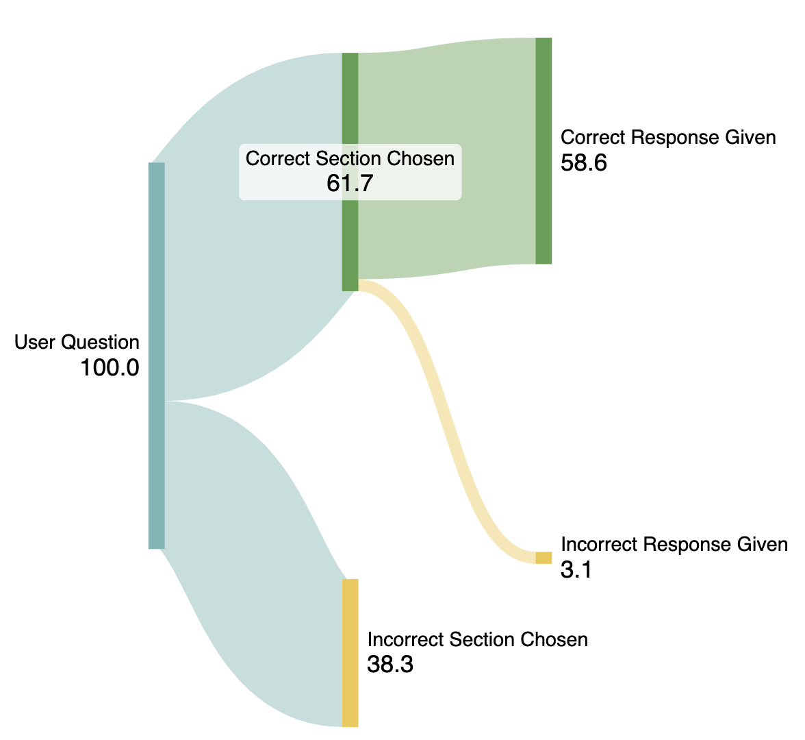

# LLM Prototype for Interacting with Financial Documents

## Introduction
This document summarizes a **Large Language Model (LLM) prototype** designed to enable users to interact with and query their structured data effectively. Leveraging natural language processing (NLP) and an adapted RAG Architecture, the system takes user queries, returns the most relevant structured content section, and prompts an LLM with this added context to compute the answer to a given question. 

The source document provided was used to provide context and test data to assess prototype performance.

Provided source document: [train.json](https://github.com/czyssrs/ConvFinQA)

## Design Overview
This initial prototype operates the following key steps:

- **Data Preprocessing:** The provided `train.json` dataset is split into two files, `datasets/deduplicated_content.json` (used by the prototype to generate responses) and `datasets/indexed_qa.json` (a reference source truth test dataset that provides example question and answer pairs that are used to assess design performance).
- **Generation of Section Summaries:** Using the `deduplicated_content.json` file, the individual sections (top level dictionaries in the `train.json` file), have their content summarized using OpenAI's gpt-4o-mini model. Embeddings of these summaries are then generated to enable programmatic interactions with the `deduplicated_content.json` and to efficiently retrieve the relevant section for context when answering a user question.
- **User Questions:** Any user question asked is vectorized into a text embedding, using the same method and model as the previous step. A cosine similarity score with this question embedding is generated against each section summary embedding. The section(s) with the strongest cosine match score, returns the corresponding dictionary section(s) of `deduplicated_content.json`**. The returned structured section(s), along with the user question, is used to prompt the LLM and give additional relevant context to calculate the answer. The prompt also contains a few shot prompt structure to help standardize the response and more objectively assess performance.

** The initial prototype has 3 operating methods, either returning the top cosine similarity match section for context, or returning the top 3 or 5 sections. In the case of the last two methods, the LLM is prompted repeatedly with the context, 3 or 5 times respectively. It is then asked to evaluate which answer it believes best answers the initial question as part of a final prompt.

## Metrics & System Accuracy
To effectively evaluate the system’s performance, precision and recall metrics were calculated. To note, two precision metrics are established due to the prototype having two key steps in the architecture. This granularity enables clearer performance insight and more targeted further development. 

In the absence of any clear user or system requirements, the concise list of metrics calculated at this stage is to keep the summary punchy and relevant. With the current level of information provided, it is difficult to define metrics around cost and other factors effectively. If these are clarified at a later stage, these metrics could be captured. The current metrics are defined as:

- **Section Precision** 

    The number of times the prototype successfully identifies the correct section of the `deduplicated_content.json` document to provide context to generate the response. Given as a percentage of the total number of test iterations.

- **Section Latency** 

    Average time taken to create the text embedding of the input question, assess it against the `deduplicated_content.json` embeddings and return a content section match.

- **Response Precision** 

    The correct responses generated (assessed against the ground truth `indexed_qa.json` file) as a percentage of total responses. (Metric assumes the correct section is provided as context to avoid skewing the result).

- **Response Latency** 

    Average time taken (via an API call to OpenAI) to generate a final response to the user question, given the question and relevant context.

### Key Results
#### Section results 
Generated from a sample test question dataset, comprised of 100 randomly selected questions from `indexed_qa.json` and using all `deduplicated_content.json` data.
| Metric                | Top Match Prototype Variant | Top 3 Match Prototype Variant | Top 5 Match Prototype Variant | Initial Thoughts |
|-----------------------|----------------------------|------------------------------|------------------------------|-----------------|
| **Section Precision** | 41.7%                      | 53.3%                        | 61.7%                        | Performance is poor for this question sample set, especially when only using the top cosine match. Using the top 3 or 5 subset does substantially improve the chances of a match, but it is still likely under performing for most scenarios. |
| **Section Latency**   | 0.027s (avg per iteration) | 0.027s (avg per iteration)   | 0.027s (avg per iteration)   | Latency is consistent due to the cosine match calculation being highly performant. |

#### Response results
 Generated from a sample test dataset, comprised of 20 randomly selected question answers pairs from `indexed_qa.json`. 
 
 To effectively assess the response only, the correct section content from the `deduplicated_content.json` is provided. For the top 3 and 5 variations, the correct section content along with other sections defined by the cosine similarity output are provided. 
 
 The smaller sample size used is to limit excessive openAI API costs at the early stage of prototyping, with the sample selected given a insight into performance.

All responses were manually compared to the source truth as despite the few shot prompting helping format the response, the variation in source truth answers (i.e. significant figures used and additional characters) meant automated comparison could be a poor reflection of actual performance.

| Metric                | Top Match Prototype Variant | Top 3 Match Prototype Variant | Top 5 Match Prototype Variant | Initial Thoughts |
|-----------------------|----------------------------|------------------------------|------------------------------|-----------------|
| **Response Precision** | 100%                      | 100%                        | 95.0%                        | Results suggest excellent performance. Given the correct context or a small subset to iterate over, the prompted LLM performs strongly in reaching the correct answer. |
| **Response Latency**   | Average of 1.78 seconds   | Average of 7.46 seconds     | Average of 10.3 seconds     | The current sequential operating configuration causes latency to increase relatively linearly with more steps. To mitigate this, using agents to parallelize processing over the 3 or 5 variations would reduce overall latency by completing context prompts in parallel before prompting a final decision response. This requires responses to be stored and structured appropriately for the final decision. |

Overall precision metrics can be found below. As the current initial prototype runs operations sequentially, the latency values captured in the tables above can be used to approximate a total latency.

| Metric                 | Top Match Value | Top 3 Match Value | Top 5 Match Value | Initial Thoughts |
|------------------------|----------------|-------------------|-------------------|------------------|
| **Prototype Precision** | 41.7%          | 53.3%             | 58.6%             | The precision values are low, suggesting the current prototype is not production-ready. Availability of the system and user requirements could confirm this. The "Further Work" section outlines next steps to explore. |

A Sankey diagram is a clear way to visualize current performance and the key areas for further development.

*Figure 1: Sankey Diagram Illustrating Precision Performance of Developed Top 5 Match Value Prototype.*

## Main Findings & Shortcomings
### Findings:
- The initial prototype design provides a scalable architecture to interact with structured documents (texts, tables, figures, etc.).
- The current prototype would likely require further refinement and development before it could be deployed. But metric thresholds like precision need to be defined by user and system requirements.
- The provided `train.json` contains duplicate content sections. These impact the performance of the prototype. Content tables and text should be deduplicated if further development is completed to improve performance.

### Shortcomings:
- The current prototype only uses a single section for context, a question that may require multiple sections to generate an answer will provide non-optimal responses.
- The generated section summaries used as the intermediary step are not perfect, they are subjective and although the generation prompt was refined to standardize the response and improve its objectivity, it does not always perfectly summarize the section. The section summaries in this prototype design are key as they are needed to represent the structured section context when compared against the user question and therefore the design is only as good as these summaries.

## Further Work
To enhance the prototype, the following improvements should be considered:

- **Identify Deployment Requirements:** Current metric values may or may not be suitable depending on requirements, and so defining requirements will inform where further improvement is necessary.
- **Further explore multiple response attempts:** The initial effort in prototype development was to only use the closest section match to the question to inform the response, a fair assumption given the `train.json` structure. Some initial effort was completed to architect the multiple section responses, given initial performance concerns, and compare responses to inform a final response. Despite this initial effort, this idea could be further explored to improve performance and identify an optimal trade off.
- **Explore alternative designs:** During  initial prototyping, there has been limited time to test and compare alternate ideas. For example:
    - Graph RAG - Pre processing the data into a graph database would be time consuming but once done could provide superior performance for chatbot interaction. The RAG step would generate a query to return a subgraph which is used as context for the final response. The Context data would be more logically stored using a defined ontology to make retrieval more predictable, which as seen in the current results is the key to improving the overall system.
- **Explore and compare other models:** Minimal model comparison was completed and a OpenAI model (gpt-4o mini) was favoured for the Response section due to tomoro.ai's alliance. It is almost guaranteed performance improvements could be made by comparing various model options at the multiple steps described in the Design Overview. This includes the text embedding generation step of user questions and section summaries.
- **Iterate and mature metrics:** As requirements for the prototype and how it is being used is further defined.
- **Vector Database:** Use to store the reference section text embeddings, enabling efficient storage and lookup performance. This is best practice but likely a low priority given current metrics.
- **Dockerize prototype:** Enabling the prototype to be shared and run by others to continue development and deploy predictably.
- **Model Fine-tuning on domain-specific datasets:** The current performance, as seen by the metrics, could be improved. It may be that model fine tuning is also explored along with a optimized architecture to improve overall performance. This would require training data, and is mentioned specifically in this case as the `train.json` data is suitably formatted to do this.
